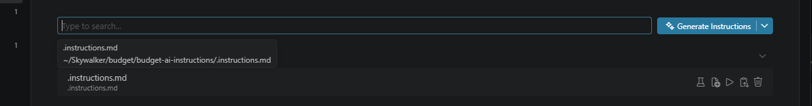
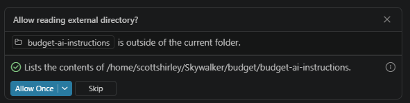

# Budget AI Skills Repository

This repository contains model-agnostic AI skill guidance tuned for GitHub Copilot in VS Code.

## Repository Layout
- .instructions.md: root instruction file to load in Copilot chat settings.
- backend/: backend coding skills.
- frontend/: frontend coding skills.
- infrastructure/: architecture, deployment, and infra-focused guidance.
- tools/: scripting and command safety guidance.

## Setup In VS Code

Clone this repo once to a stable location. After setup, Copilot loads `.instructions.md` and
routes to the appropriate SKILL.md automatically in every workspace — no per-repo configuration required.

1. **Clone** this repo to a permanent path on your machine (e.g. `~/repos/budget-ai-instructions`).

2. **Open VS Code user settings** (`Ctrl+Shift+P` → *Preferences: Open User Settings (JSON)*).

3. **Add or merge** the following, replacing the path with your actual clone location:
   ```jsonc
   "chat.instructionsFilesLocations": {
     "/your/path/to/budget-ai-instructions": true
   }
   ```
   example: `"~/Skywalker/budget/budget-ai-instructions/.instructions.md": true,`

   If the key already exists, add the new entry alongside any existing ones.

4. **Reload the window** (`Ctrl+Shift+P` → *Reload Window*).

5. **Verify** by opening any of your repositories and asking Copilot: "What repository rules apply here?"



> **Note:** This setting lives in your personal VS Code profile, not in any repo. Each team member
> performs this setup once after cloning.

## Use
The main instruction file is hardcoded in the setup and reads from an external repository.
Because of this, when a chat session is started you will be asked to allow reading outside the working directory.  
**Click allow**.
This is a limitation to housing the AI skills in its own repository.



## How To Add A New Skill
1. Pick the correct domain folder: backend, frontend, infrastructure, or tools.
2. Create a focused subfolder and add SKILL.md.
3. Include YAML frontmatter with at least:
   - name
   - description
   - argument-hint
4. Keep scope narrow and actionable.
5. Add the skill path to .instructions.md Skill Index.
6. Update the domain README with the new skill and trigger guidance.

## Skill Verification Prompts
Use these prompts in Copilot Chat to validate skill routing.

### Backend
- I need a C# unit test for an EF Core manager with PostgreSQL. What is the standard transactional test pattern?
- I am adding a BFF endpoint that writes to two services. How should compensating rollback be implemented?
- How should backend feature flags be evaluated through the BFF in this ecosystem?

### Frontend
- How should frontend feature flags be loaded and consumed in Angular while keeping evaluation through the BFF?
- I am adding an Angular NgRx feature. What are the required actions/effects/reducer/selector conventions?
- Should I use shareReplay on NgRx selector streams, and what cleanup pattern is expected?

### Infrastructure
- What are the required environments, regions, deployment, and config defaults for this platform?
- Which docs should I use to understand snapshot and restore behavior?

### Tools
- What command safety checks should I follow before running build or migration scripts?

## Troubleshooting Skill Activation
- If responses are generic,ensure the .vscode *user* settings were updated, not the local workspace
- Check VS Code user `settings.json` for a `chat.instructionsFilesLocations` entry pointing to this repo.
- Reload the VS Code window after any settings change.
- If a specific skill does not trigger, include domain keywords from that skill description.
- If paths changed, update .instructions.md Skill Index and domain README entries.
